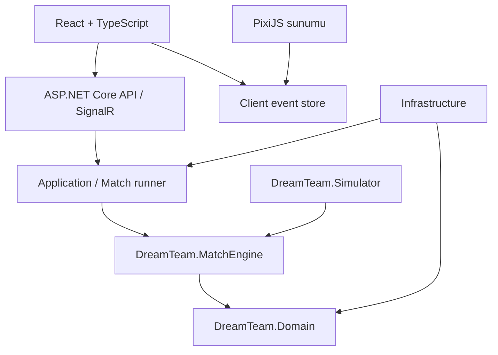

# Teknik mimari

## Durum

Önceki yön: React + TypeScript, PixiJS, SignalR, ASP.NET Core, saf C# MatchEngine, PostgreSQL veya MSSQL; gerektiğinde Redis. **DB, runtime/paket sürümü ve hosting kesinleşmedi.** İlk geliştirme bütün katmanları oluşturmaz.

## Bağımlılık sınırı



Oklar derleme/çağrı yönünü özetler; eventlerin server'dan client'a veri akışı ayrı sözleşmede tanımlıdır. Domain bağımsızdır. MatchEngine saf hesaplamadır. API composition root, seçilen altyapı implementasyonlarını bağlar.

## Başlangıç solution önerisi

| Proje/yol | Sorumluluk | Ne zaman |
|---|---|---|
| `src/DreamTeam.Domain/` | Player, ratings, team/lineup ve ortak değer tipleri | M1 |
| `src/DreamTeam.MatchEngine/` | State, actions, rules, RNG, events, diagnostics | M1–M5 |
| `src/DreamTeam.Simulator/` | Dosyadan fixture/config okuyup tek/batch maç çalıştırma | M2/M6 |
| `tests/DreamTeam.MatchEngine.Tests/` | Davranış, invariant ve replay testleri | M1 |
| `tests/DreamTeam.Simulator.Tests/` | CLI/export ve batch tutarlılığı | M6 |
| `fixtures/teams/` | Kurgusal fixture tanımları | M2 |
| `config/engine/` | Sürümlü balance/rules dosyaları | M2 |
| `src/DreamTeam.Application/` | Use case, runner orchestration, portlar | M7 |
| `src/DreamTeam.Infrastructure/` | DB, persistence ve dış adaptörler | M7 |
| `src/DreamTeam.Api/` | HTTP, auth, SignalR, composition root | M7 |
| `web/` | React yönetim ekranları ve PixiJS | M8/M9 |

Bu yollar yeni repo önerisidir. Var olan repo başka biçimdeyse önce gerçek yapıya eşleştirilir. `.sln`/`.slnx`, test framework'ü ve SDK kararı M0'da ortamla doğrulanır.

## Motor modülleri

Core: MatchEngine, MatchState, PossessionState, clock ilerletme.
Ratings: oyuncu composite'leri ve beşin bağlamsal özellikleri.
Actions: ActionSelector, Handler/Shooter/Defender seçimi, shot/turnover/rebound çözümü.
Rules: foul/FT, clock reset, legal substitution, periyot/uzatma.
Fatigue: enerji tüketimi ve toparlanma.
Randomness: deterministik RNG; `Random` namespace'i platform sınıfıyla karışmasın diye önerilen ad.
Events: tipli olaylar ve event sink.

Bunlar sorumluluk sınırlarıdır; her isim için zorunlu interface veya ayrı servis üretme. Örneğin LineupSynergyCalculator için ayrı davranış yoksa sınıf oluşturma; ilk sürüm chemistry sistemi içermez.

## Offline ile canlı yürütme

Devir önerisi: aynı motor bir adımlama çekirdeği üzerinden çalışsın. Kavramsal sözleşme:

```csharp
MatchState Create(MatchSetup setup);
StepResult Advance(MatchState state, IReadOnlyList<ScheduledManagerCommand> commands);
MatchResult Simulate(MatchSetup setup, IReadOnlyList<ScheduledManagerCommand> commands);
```

Bu imzalar hedef sözleşmedir; derlenmiş API değildir. `Advance` bir sonraki anlamlı kural/action sınırına ilerler. `StepResult` yeni state, events, command sonuçları ve durum taşır. `Simulate` aynı çekirdeği bitene kadar çağırır; ikinci bir simülasyon algoritması yazılmaz.

- Console mümkün olan en hızlı biçimde ilerler.
- Canlı runner simüle zamanı duvar saatiyle eşler ve komut kabul pencerelerini yönetir.
- Motor `DateTime.Now`, sleep, network veya UI animasyonu beklemez.
- Motorun maçın tamamını baştan üretip client'a yavaşça göstermesi canlı müdahaleyle çelişir; canlı modda ilerleme sınırları gerekir.

## Sürüm ve tekrar üretilebilirlik

Setup digest; engine, rules, balance, RNG ve roster/rating snapshot sürümleriyle ilişkilidir. Komutların kabul sırası ve uygulandıkları mantıksal sınır kaydedilir. Aynı seed tek başına yeterli değildir.

Olay oynatma ile motoru yeniden çalıştırma ayrı özelliklerdir. Eski motor binary'si yoksa saklanan eventlerden maç izlenebilir; eski maçın yeniden hesaplandığı iddia edilmez.

## API ve persistence — sonraki aşama

Başlangıç için modüler monolit ve tek maç yürütücüsü önerilir. Match runner aynı maçın state'ini tek sahip altında seri değiştirir. Farklı maçlar bağımsız çalışabilir.

Kalıcı maç başlangıcı snapshot'ı, olay sırası, sonuç ve ekonomi yazımı tanımlanır. Match completion idempotent olmalı; aynı maç ödülü yeniden verilmemeli. Dağıtık worker, lease/fencing ve transactional outbox ancak çoklu instance veya güvenilir iletim gereksinimi geldiğinde ayrıca tasarlanır.

Redis bir zorunluluk değildir; memory state'in yedeği yerine rastgele eklenmez. Yeniden başlatma sonrası maç kurtarma politikasının sahibi M7/M11 tasarımıdır.

## Client sınırı

React hesap/kadro/taktik/pazar arayüzünü yönetir. Client event store gelen olayları sıralar ve deduplicate eder. PixiJS bu store'daki sunum olaylarını canlandırır. Client oyuncu rating'lerinden skor hesaplamaz; eventlerdeki skor otoritatiftir.

Render animasyonları kozmetiktir. Koordinat veya maç fiziği uydurarak motorsal outcome değiştirme. Sonraki renderer Flutter/Three.js olsa da aynı sözleşme kullanılabilir.

## Kaçınılacak erken karmaşıklık

Generic repository zorunluluğu; CQRS/event sourcing framework'ünün varsayılan kurulumu; mikroservisler; Kubernetes; her modüle event bus; ilk sprintte bütün DB tabloları; oyun motorunda ORM entity'leri. Event kaydı olması tüm ürünün event sourcing gerektirdiği anlamına gelmez.
