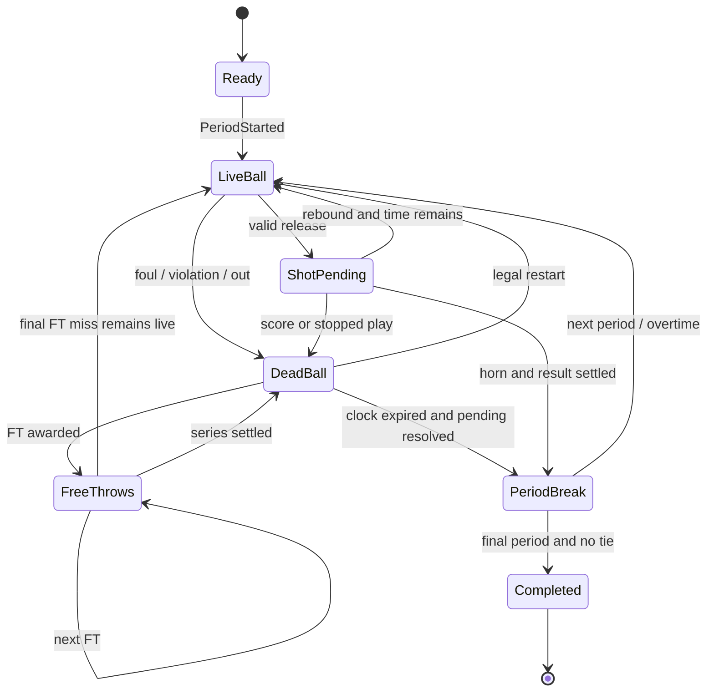

# Kurallar, saatler ve durum makinesi

**Durum:** Önceki tasarımın eksik bıraktığı kural ayrıntılarını gösteren devir önerisi. Aşağıdaki profil kullanıcı tarafından tek tek onaylanmadı. Tam NBA kuralları uygulandığı iddia edilmiyor.

## 1. Kural profili kararı

Basketbol simülasyonu süresi ile live viewer duvar saati hızı ayrı tutulur. Önerilen başlangıç: NBA esinli sade profil. FIBA ve NBA kurallarını farkında olmadan karıştırma.

| Alan | Devir önerisi | Kilitleneceği aşama |
|---|---|---|
| Normal süre | 4 × 12 dakika | M0/M2 |
| Uzatma | 5 dakika; eşitlikte tekrar | M0/M3 |
| Hücum saati | Yeni kontrol için 24 saniye | M0/M2 |
| Hücum ribaundu reset | Çembere temas eden kaçan şut / canlı son FT sonrası 14 saniye | M0/M3 |
| Kişisel faul sınırı | 6 | M3; resmî ayrıntı ayrıca doğrulanır |
| Takım bonusu | Basit profil: periyot içinde 5. sayılan savunma faulünden itibaren 2 FT | M3; NBA'nin tüm istisnaları değildir |
| Uzatma bonusu | Basit profil: OT sayacı sıfırlanır, 4. sayılan savunma faulünden itibaren 2 FT | M3; ürün profili olarak onaylanır |
| Timeout | İlk öneri takım başına maçlık 4; OT'ye +1, süre simüle canlı saate eklenmez | M5; NBA timeout kuralı iddiası değildir |
| Devre arası / mola dinlenmesi | Ayrı recovery parametreleri; canlı game time tüketmez | M4/M5 |
| Beşten az uygun oyuncu | Sessizce 4 kişi oynatma veya foul-out geri alma yok; açık forfeit/abort policy | M3 |
| İleri kural istisnaları | Teknik/flagrant, challenge, defensive three seconds, backcourt ve jump-ball ayrıntıları dışarıda | M0 onayı |

Süre örneklerinin basketbol referansları R07/R08; bonus/timeout önerileri **özel oyun basitleştirmesidir**. Tam NBA sadakati istenirse Rule 3/5/7/9/12 ve son iki dakika istisnaları ayrı spesifikasyon gerektirir. “NBA profili” diye etiketlenen fakat bu ayrıntıları içermeyen ürün yayımlama.

## 2. Saat modeli

Devir önerisi: bütün motor süreleri integer milisaniye; runtime boyunca tek birim. Bir action canlı süre tükettiğinde hem GameClock hem ShotClock doğru miktarda ilerler. Serbest atış, substitution ve dead-ball işlemleri canlı game clock tüketmez; dinlenme zamanı ayrı modeldir.

Shot release, uçuş ve top kontrolü zamanları ayrılmalı. Release saat dolmadan geçerliyse sonuç horn sonrasında çözülebilir. Periyot saati dolduğunda o periyotta yeni aksiyon/rebound başlatılmaz; geçerli pending şut/FT işlemleri tamamlanır.

Shot clock bitmesi ile geçerli release eşzamanlı sınırı için tek tie-break tanımı gerekir. Öneri: `releaseTime < expiryTime` geçerli, eşitlikte ihlal; onaylandıktan sonra testle sabitle. Çembere temas/reset ile game clock bitişi aynı anda ise periyot bitişi yeni possession başlatmamalı.

Simülasyon zamanı daima ilerlemeli veya sonlu bir dead-ball zinciri tükenmelidir. Guard eşiği aşılırsa maç `Aborted` olur; skor uydurulup Completed yapılmaz.

## 3. Durum geçişleri

Şema ana akıştır; her transition'ın guard'ı kodda ve testte bulunmalı. Herhangi bir aktif phase'te kritik invariant bozulması Aborted sonucuna gidebilir. LiveBall'da pending şut olmadan game clock sıfırlanması da önce bitiş settlement'ına, sonra PeriodBreak'e gider.

## 4. Possession muhasebesi

Önerilen operational tanım: hücum takımının kontrol kazanmasından topu rakibe devretmesine veya periyodun bitmesine kadar tek kimlik. Başladı/tamamlandı sayaçları ayrı tutulabilir; periyot sonunda kesilen hücumların raporda nasıl sayıldığı tanımlanır.

| Olay | Possession | Sonraki durum |
|---|---|---|
| Normal basket, and-one yok | Tamamlanır | Rakip inbound |
| Savunma rebound kontrolü | Tamamlanır | Rakip yeni possession |
| Canlı steal kontrolü | Tamamlanır | Rakip transition adayı |
| Travel / shot-clock ihlali | Tamamlanır | Rakip inbound |
| Offensive foul | Tamamlanır | Rakip restart |
| Offensive rebound | Aynı Id devam | Geçerli reset veya kalan shot clock |
| Non-shooting foul, bonus yok | Aynı Id devam | Aynı takım inbound |
| Shooting foul | FT sonucu beklenir | And-one/2/3 FT |
| Son FT isabet | Normal durumda tamamlanır | Rakip inbound |
| Son FT kaçtı, hücum rebound | Aynı Id devam | Yeniden hücum |
| Defans topu dışarı gönderdi | Aynı Id devam | Kurala göre saat korunur/reset |
| Periyot bitti | Devam eden possession kapanır | Sonraki periyot protokolü |

Başlangıç ve periyot açılış kontrolü, home/away bias yaratmayacak deterministic/seeded yöntemle seçilmeli. Basket sonrası hemen yeni possession başlatıp aynı basketin FT'sini rakibin possession'ına yazma.

## 5. Şut, faul ve FT muhasebesi

Aşağıdaki davranışlar önerilen oyun istatistik sözleşmesidir; daha ayrıntılı resmî skor tutma iddiası taşımaz.

- Normal isabet: bir FGA + bir FGM, türüne göre 2/3 sayı; uygunsa tek asist.
- Normal miss: bir FGA; block varsa aynı denemeye bağlı tek BLK.
- İsabetli shooting foul: FGA/FGM ve sayı, ardından 1 FT. Assist mümkünse aynı isabete bağlıdır.
- Kaçan shooting foul: fiziksel shot olayı gösterilebilir; box score'da FGA sayılmaz, 2 veya 3 FT verilir. `CountsAsFieldGoalAttempt=false` açıkça taşınır.
- Offensive foul: faul ve turnover tek aksiyonun etkileridir; iki turnover yazılmaz. Savunma bonusu sebebiyle otomatik FT üretmez.
- Bonus olmayan non-shooting foul: FT yok; hücum korunur.
- Bonus FT'leri: uygulanmış rules profile'a göre sayısı belirlenir; shooter kimliği açıktır.
- FT arası miss için canlı rebound yok. Son FT miss'i yalnız top canlıysa rebound üretir.
- FT'de FGA/FGM/3PA artmaz. FTA ve FTM ayrı.
- Her missed attempt'e otomatik oyuncu rebound'u dağıtma; periyot sonu, ölü top ve dışarı çıkan top farklıdır.

## 6. Shot-clock reset tablosu

| Durum | Önerilen davranış |
|---|---|
| Rakip kontrolü ile yeni possession | 24s, kalan periyot süresi ayrıca işler |
| Çembere değen miss sonrası OREB | 14s |
| Çembere değmeyen miss/block sonrası aynı hücum kontrolü | Önceki kalan süre; otomatik 14s yok |
| Defans deflection, hücum kontrolü sürüyor | Reset yok |
| Defansif non-shooting foul ve aynı hücum restart | Frontcourt/backcourt ayrımı profile'da seçilir; M3 tablo kararı gerekir |
| Timeout, aynı hücum devam | Kendi başına reset sebebi değildir |
| Periyot başı | Yeni periyot kontrolü protokolü |

M2 dar vertical slice'ı yalnız normal basket/miss/rebound içeriyorsa bunu engine tamlığı gibi raporlama. Foul ve bütün reset varyantları M3 bitmeden v0.1 doğrulanmış sayılmaz.

## 7. Substitution ve timeout pencereleri

“Her possession bittiğinde değişiklik” kuralı yanlış bir varsayımdır. DREB/steal sonrası oyun canlıdır. Önerilen ilk profil; faul/ihlal sonrası uygun dead-ball, timeout, periyot arası pencerelerini kullanır. Normal basketten sonra otomatik substitution penceresi açılıp açılmayacağı M5'te açıkça seçilir; varsayılan olarak açılmaz.

Substitution istek kabulünde ve uygulama anında tekrar doğrulanır. Aynı oyuncunun iki istekle sahaya girmesi, foul-out sonrası geri gelmesi ve beşin geçici olarak dört/altı kişi olması engellenir. Çoklu değişiklik bir atomik lineup geçişi olarak uygulanır.

Faulden çıkan oyuncu için otomatik replacement policy zorunludur; kullanıcının çevrimdışı kalması maçı sonsuza kadar durdurmaz. Kullanılabilir beşli kurulamıyorsa seçilen forfeit/abort sonucu uygulanır.

## 8. Uzatma ve terminal durumlar

Q4 bitişindeki bütün geçerli şut/FT sonuçları işlendiğinde skor eşitse OT açılır. Oyuncu kişisel faulleri ve enerji korunur; team foul/timeout policy profile'a göre değişir. OT sonunda eşitlik varsa sonraki OT.

Batch çalıştırmada güvenlik limiti olabilir; limit aşımı bir performans/kurallar arızası olarak raporlanır. Eşit maça rastgele kazanan seçilmez. Aborted/forfeit örnekleri normal win-rate paydasına sessizce katılmaz.
