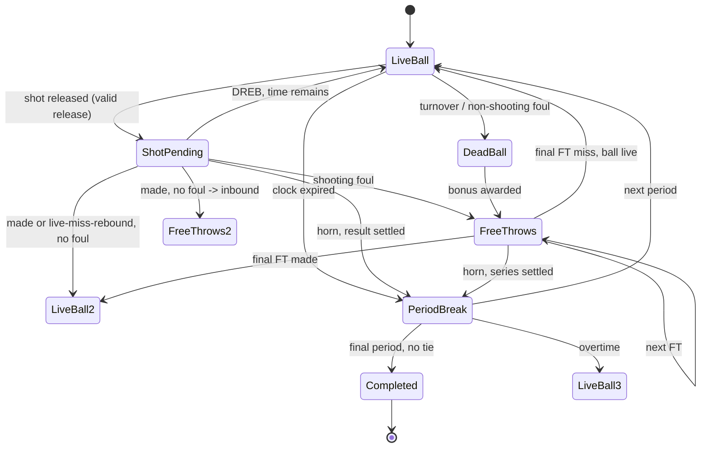

# M3 — Kural Bütünlüğü: Uygulama Planı

> **Durum:** Uygulandı ve doğrulandı (27 Eylül 2026). Aşağıdaki kabul tablosu
> gerçek koşu sonuçlarıyla dolduruldu. Sapmalar §12'de kayıtlı.
>
> **Kapsam:** Faul, bonus, serbest atış, blok, hücum saati reset politikası, periyot/uzatma
> kontrolü, foul-out ve yedekleme, terminal politikalar.
>
> **Dışında:** Substitution pencereleri, timeout, out-of-bounds, tactics/pace, enerji,
> jump ball, savunma 3 saniye, batch/CLI, API, DB, frontend.

## 0. Bu oturumda kilitlenen kararlar

| ID | Karar | Gerekçe |
|---|---|---|
| D40 | **Bonus: basit profil.** Periyot içinde 5. sayılan savunma faulünden itibaren 2 FT. Kişisel faul sınırı **6**; 6. faulde oyuncu sahadan çıkar | 06 §1'in devir önerisi. NBA'nın 3 saniye kuralı ve son 2 dakika istisnaları kapsam dışı; tam NBA sadakati iddiası yok |
| D41 | **Foul-out sonrası otomatik yedekleme.** En uygun yasal yedek sahaya girer; kimse yoksa açık terminal policy | 06 §7'nin devir önerisi. Kullanıcı çevrimdışı kalsa maç sonsuza kadar durmaz |
| D42 | **Tie-break ve periyot başı.** `releaseTime < expiryTime` geçerli, eşitlikte ihlal. Her uzatmada hücum saati 24 s'e döner ve takım faul sayacı sıfırlanır | 06 §1 ve §2'nin devir önerisi. 06 §6'daki belirsiz "periyot başı" satırı böyle kapanır |

### M3'te değişmesi gereken M2 sözleşmeleri

Bu değişiklikler **beyan edilmiş ve gerekçelendirilmiştir**:

| Değişiklik | Neden | Etkilenen test |
|---|---|---|
| `MatchPhase`'e `ShotPending` ve `FreeThrows` eklenir | 06 §3 ana akışı bu iki fazı içerir; M2'de kısmi durum yoktu | M2 testleri faz değeri okumadığı için etkilenmez |
| `MatchState`'e `PendingShot?` ve `PendingFrees?` alanları | Bırakılmış şut ve FT serisi **devam edilebilir** olmalı; M5 replay bunu serileştirecek | M2 testleri yeni alanları okumuyor |
| `TeamMatchState`'e `FoulOutPlayerIds` | D41'in yasal yedek hesabı bunu gerektirir | — |
| `MatchResult.PeriodsPlayed` artık uzatmayı da kapsar | 5, 6, 7… periyot | — |
| `EventSchemaVersion` 1 → **2** | Yeni event türleri | — |
| Yeni event türleri: `Foul`, `FreeThrowAttempt`, `FreeThrowMade`, `FreeThrowMissed`, `Block` | 07 §2'nin faul/FT ailesi | — |
| `TeamMatchState`'e `Fouls` (`FoulCounters`) | Kişisel ve periyot faul sayaçları | — |
| `PossessionEndReason.BonusFreeThrows` | 06 §4 tablosunda bonuslu non-shooting faul satırı **yoktu**; turnover da değil. Sonucu adlandırmak için eklendi | — |
| `Config`'e `FoulModel`, `FreeThrowModel`, `FoulType` | 06 §1'in faul profili | `ConfigHash` değişir |

**Değişmeyecekler:** `MatchSetup`, `MatchClock` (üç sayacın anlamı), `Advance` imzası,
`IRandomSource`, `MatchSetupValidator`, `EngineIdentity`. M5'e bırakılan genişletme
(`Advance` imzasına komut listesi) M3'te yapılmaz.

### Bilinen yan etki: RNG çağrı sırası değişir

M3 yeni çekilişler ekler (faul, blok, çember teması, FT sonucu). Bu, M2'de üretilen
sonuçları **değiştirir**; bu beklenen ve kabul edilen bir sonuçtur.

M2 testleri hiçbir golden sabit içermez — aynı build içinde iki koşuyu karşılaştırır.
Bu yüzden `SameSetupAndSeedProduceAnIdenticalEventStream` gibi testler bozulmaz.
M6'da golden sequence sabitlenecek.

## 1. Adım sınırındaki mimari değişiklik

M2'de bir `Advance` çağrısı bir aksiyonu baştan sona bitiriyordu. M3'te iki kısmi
durum ortaya çıkar:



**Sonuç:** `Advance` bir sonraki *anlamlı sınra* ilerler ve bu sınır bir aksiyonu
bitirmek zorunda değildir. `Simulate` döngüsü değişmez.

### Devam edilebilir durum

```csharp
public sealed record MatchState
{
    // ... M2 alanları

    /// <summary>Bırakılmış şut: bırakıldı, sonucu bekleniyor. M2'de şut senkron çözülürdü.</summary>
    public required PendingShot? PendingShot { get; init; }

    /// <summary>Devam eden serbest atış serisi. FT arası canlı rebound yok.</summary>
    public required PendingFreeThrowSeries? PendingFrees { get; init; }
}

public sealed record PendingShot
{
    public required long ActionId { get; init; }
    public required long ShotId { get; init; }
    public required long FoulId { get; init; }
    public required FoulType FoulType { get; init; }      // Shooting yalnız
    public required Guid ShooterId { get; init; }
    public required ShotType ShotType { get; init; }
    public required int SkillRating { get; init; }
    public required bool RimContact { get; init; }        // 06 §6 reset tablosu
    public required int FreeThrowCount { get; init; }      // 0 = FT yok
}

public sealed record PendingFreeThrowSeries
{
    public required long FTSeriesId { get; init; }
    public required Guid ShooterId { get; init; }
    public required int Index { get; init; }              // 0 tabanlı
    public required int Count { get; init; }
    public required bool FinalShotIsLive { get; init; }   // son FT canlı mı
    public required bool GivesRebound { get; init; }       // son FT miss'i ribaund üretir mi
    public required TeamSide Offense { get; init; }
}
```

Bu iki tip M5'te serialize edilecek. Bu yüzden nullable alan yerine **açık
"yok" durumu** taşırlar ve kısmi nesne kurulamaz.

## 2. Oluşturulacak dosyalar

```
src/DreamTeam.MatchEngine/
  Core/PendingShot.cs                       # yukarıda
  Core/PendingFreeThrowSeries.cs            # yukarıda
  Actions/FoulResolver.cs                   # faul + foul türü + FT sayısı
  Actions/BlockResolver.cs                  # blok (T04)
  Actions/FreeThrowResolver.cs              # FT sonucu
  Actions/RimContactResolver.cs             # çember teması (reset tablosu)
  Rules/ClockResetPolicy.cs                 # 06 §6 tablosunun tamamı
  Rules/PeriodController.cs                 # periyot/uzatma geçişi, periyot süresi
  Rules/EligibilityPolicy.cs                # yasal yedek, foul-out seti
  Events/MatchEventPayloads.cs              # 5 yeni payload (mevcut dosyaya eklenir)
  Events/MatchEventType.cs                  # 5 yeni tür (mevcut dosyaya eklenir)

tests/DreamTeam.MatchEngine.Tests/
  M3TestData.cs                             # faul/FT senaryo konfigürasyonları
  FoulResolverTests.cs
  FreeThrowSeriesTests.cs                   # T07
  BlockAndRimContactTests.cs                # T04, T06
  ClockResetPolicyTests.cs                  # T06, T09
  PeriodAndOvertimeTests.cs                 # T10
  EligibilityTests.cs                       # T08, T11
  M3InvariantTests.cs                       # 08 §2'nin M3'e düşen kısımları
```

`RulesProfile`, `FoulType`, `ShotType`, `TurnoverKind`, `MatchPhase` genişler.
`MatchSetup`, `MatchClock`, `MatchSetupValidator` **dokunulmaz**.

## 3. Karar ağacı — tek kanonik çözüm

05 §8'deki en sık yapılan hata, faul/şut/top kaybı dallarını **bağımsız çekilişlerle**
kurup aynı aksiyonda çelişkili sonuçlar üretmektir. M3 tek bir ağaç kurar ve RNG çağrı
sırasını sabitler.

```
Advance (LiveBall, kurulum fazı):
  1. aksiyon seçimi        : 2 çağrı  (aksiyon, oyuncu)
  2. top kaybı çekilişi   : 1 çağrı  → turnover? event + possession kapanır
  3. kurulum süresini tüket (M2 ile aynı)
  4. FAUL çekilişi        : 1 çağrı  → faul var mı, türü ne
  5. şuta dönüşme çekilişi: 1 çağrı  → hayırsa ActionCompleted, possession devam
  6. bırakma geçerliliği   : ShotClockMs > 0 ? değilse ShotClockViolation
  7. ÇEMBER TEMASI çekilişi: 1 çağrı  (06 §6 reset tablosu)
  8. FAUL TÜRÜ kesinleşme  : faul çekilişi şutun kendi dalında; 05 §122-125 sırası
  9. uçuş süresini tüket   → MatchPhase.ShotPending, PendingShot yazılır

Advance (ShotPending):
 10. BLOK çekilişi        : 1 çağrı  → blok? (block/make/miss ayrımı, 05 §124)
 11. isabet çekilişi      : 1 çağrı  → yapay blok zaten isabeti engellemiş sayılır
 12. tek canonical settlement: ShotMade | ShotMissed(+Block)
 13. faul varsa → FreeThrows; yoksa rebound yolu (M2 ile aynı)

Advance (FreeThrows):
 14. FT çekilişi          : 1 çağrı  (FT taban olasılığı FreeThrow attribute'undan)
 15. FreeThrowMade | FreeThrowMissed event'i
 16. Index < Count-1 ise FreeThrows'ta kal
 17. son FT: canlı ise rebound yolu; değilse inbound → LiveBall
```

**Kural:** `ShotAttempt` hiçbir zaman tek başına sayaç yazmaz. `Foul` event'i
kendi başına FGA yazmaz. Bir shooting foul'lu kaçan şutta `CountsAsFieldGoalAttempt`
**false** olur ve 2–3 FT doğar (06 §87). And-one'da FGA/FGM yazılır ve 1 FT doğar.

## 4. Saat ve reset politikası

06 §6'nın tamamı `ClockResetPolicy` olarak kodlanır:

| Durum | Davranış |
|---|---|
| Rakip kontrolü, yeni possession | 24 s |
| **Çembere değen** miss sonrası OREB | 14 s |
| **Çembere değmeyen** miss/block sonrası aynı hücum | Önceki kalan; otomatik 14 s yok |
| Savunma deflection, hücum sürüyor | Reset yok |
| Periyot başı (normal) | 24 s, takım faul sayacı **korunur** |
| Uzatma başı (D42) | 24 s, takım faul sayacı **sıfırlanır** |
| Timeout | M5; bu sürümde yok |
| Non-shooting foul sonrası aynı hücum | 14 s (backcourt ayrımı bu sürümde yok, M3'te kayıt altına alınır) |

`releaseTime < expiryTime` geçerli, eşitlikte ihlal. Ufak, tereddüt edilebilir bir
kural daha **kilitlenmemiştir** ve plan onayında ayrıca sorulacaktır: şut bırakıldıktan
sonra periyot saati doluyorsa sonuç geçerli midir? 06 §29 "geçerli pending şut/FT
işlemleri tamamlanır" der, yani **sonuç sayılır**. Bu plan o yorumu esas alır ve
testle sabitler.

## 5. Periyot ve uzatma

- `PeriodController` periyot süresini verir: 1–4 için 12 dk, 5+ için 5 dk.
- `PeriodEnded` → `PeriodBreak`. Eşitlik ve son periyot ise `Completed`; değilse
  `PeriodBreak` → sonraki periyot.
- Uzatmada kişisel faullar ve enerji korunur (06 §119). Takım faulu bir **periyot
  sayacıdır**: her periyot başında sıfırlanır. D42'nin "her uzatmada sıfırlanır"
  şartı bunun alt kümesidir (bkz. §12 sapma 1).
- Çoklu uzatma: 5, 6, 7… periyot. Eşitlik bozulana kadar devam.
- `MatchResult.IsTie` yalnız `Completed` ve skorlar eşitse true. M3'te uzatma
  olduğu için pratikte tie nadir; rastgele kazanan **yine** seçilmez.
- Guard aşılırsa `Aborted`; skor uydurulmaz.

## 6. Foul-out ve yedekleme (D41)

```csharp
public static class EligibilityPolicy
{
    /// <summary>
    /// Sahada olmayan, faulden çıkmamış oyuncular arasından en uygun yedek.
    /// Sıralama: BasketballIQ azalan, Stamina azalan, kanonik kadro sırası.
    /// Bu bir YER TUTUCUDUR: gerçek rol derinliği ve uyum M4'te gelecektir.
    /// 18 attribute tablosu M1'in MatchSetupValidator'ında yaşar; burada ikinci
    /// bir tablo kopyalanmaz (bkz. §12 sapma 2).
    /// </summary>
    public static Player? SelectReplacement(TeamMatchState team);
}
```

Yasal yedek yoksa: **`MatchAborted`**, sebep `NoLegalSubstitute`. Motor bir
forfeit kazananı uydurmaz — bu bir basketbol kuralı değil, ürün kararıdır ve
M7'de ele alınabilir. 06 §121 gereği bu maçlar win-rate paydasına katılmaz.

## 7. Test senaryoları

| ID | Test | Beklenen |
|---|---|---|
| T04c | `BlockProducesNoExtraFieldGoalAttempt` | Bloklu şut: 1 FGA, 0 FGM, 1 BLK |
| T04d | `BlockedMadeShotIsNotScored` | Blok, isabet sayacına girmez |
| T06a | `RimContactOffensiveReboundResetsToFourteen` | Çembere değen miss + OREB → 14.000 ms |
| T06b | `AirballOffensiveReboundKeepsRemainingTime` | Çembere değmeyen miss + OREB → otomatik 14 s **yok** |
| T06c | `DefensiveReboundAlwaysStartsFullShotClock` | DREB → 24.000 ms |
| T07a | `AndOneAwardsExactlyOneFreeThrow` | 2P/3P isabet + faul → 1 FGA, 1 FGM, 1 FTA, 1 FTM |
| T07b | `MissedShootingFoulAwardsTwoFreeThrows` | FGA **yazılmaz**, 2 FTA |
| T07c | `MissedThreePointFoulAwardsThreeFreeThrows` | FGA yazılmaz, 3 FTA |
| T07d | `MissBetweenFreeThrowsProducesNoRebound` | Araya giren miss canlı rebound üretmez |
| T07e | `LiveFinalFreeThrowMissProducesRebound` | Yalnız son FT canlıysa |
| T07f | `FreeThrowStatisticsStayConsistent` | FTM ≤ FTA, sayaç kaybı yok |
| T08a | `BonusStartsOnFifthTeamFoul` | 4. faulde FT yok, 5. faulde 2 FT |
| T08b | `TeamFoulCounterResetsEachPeriod` | Yeni periyotta 0'dan başlar |
| T08c | `OffensiveFoulProducesExactlyOneTurnover` | Faul + tek turnover, FT yok |
| T08d | `SixthPersonalFoulRemovesPlayerFromCourt` | Oyuncu sahadan çıkar |
| T08e | `FoulOutTriggersAutomaticReplacement` | En uygun yasal yedek girer |
| T09a | `ShotReleasedAtExpiryIsViolation` | `ShotClockMs == 0` iken bırakma → ihlal |
| T09b | `ShotResolvedAfterHornIsScored` | Bırakılmış şut periyot sonunda tamamlanır |
| T10a | `TieAfterFourthPeriodStartsOvertime` | 5. periyot açılır |
| T10b | `MultipleOvertimesResolveTie` | 6, 7… periyot |
| T10c | `OvertimeResetsTeamFouls` | D42 |
| T10d | `GuardStillAbortsWithoutInventingWinner` | Eşitlikte rastgele kazanan yok |
| T11a | `NoLegalSubstituteAbortsMatch` | Aborted + `NoLegalSubstitute` |
| — | `ScoreEqualsFieldGoalsPlusFreeThrows` | `PTS == 2*2PM + 3*3PM + FTM` |
| — | `OneActionOneSettlement` | Her action id tam olarak bir settlement üretir |
| — | `NoReboundDuringFreeThrowSeries` | FT serisi sırasında rebound yok |
| — | `ShotClockIsNeverNegative` | 08 §2 |
| — | `EngineTerminatesForEverySeedWithOvertimeEnabled` | 60+ seed |
| — | `M2CoreStillHolds` | T01/T02/T04/T05 yeniden doğrulanır |

**T03 (OVR) hâlâ uygulanamaz** — OVR yok. **T15 (diagnostics) hâlâ uygulanamaz** —
diagnostics yüzeyi yok. Sahte "geçti" konmayacak.

### 7.1 Yazılan gerçek testler

Plan adları ile dosya/test adları birebir eşleşmedi. Aşağıdaki tablo **yazılmış
ve koşmuş** testleri gösterir.

| Plan ID | Yazılan test | Dosya |
|---|---|---|
| T04c, T04d | `BlockedShotIsAMissWithOneFieldGoalAttemptAndNoScore` | `M3RuleTests` |
| T04 | `BlockIsAttributedToADefenderOnCourt`, `BlockAndMissShareTheSameShotId` | `M3RuleTests` |
| T06a, T06b | `RimContactOffensiveReboundResetsToFourteenSeconds`, `AirballOffensiveReboundKeepsRemainingTime` | `M3RuleTests` |
| T06c | `DefensiveReboundAlwaysStartsWithAFullShotClock` | `M3RuleTests` |
| T07a | `AndOneAwardsExactlyOneFreeThrow` | `M3RuleTests` |
| T07b | `MissedShootingFoulAwardsTwoOrThreeFreeThrowsWithoutFieldGoalAttempt` | `M3RuleTests` |
| T07c | `MissedThreePointFoulAwardsThreeFreeThrowsAndTwoPointFoulAwardsTwo` | `M3OvertimeAndEdgeTests` |
| T07d | `MissBetweenFreeThrowsProducesNoRebound` | `M3RuleTests` |
| T07e | `OnlyTheLiveFinalFreeThrowCanProduceARebound` | `M3RuleTests` |
| T07 | `EveryFreeThrowAttemptIsSettledByExactlyOneResult`, `FreeThrowIndicesAreContiguousWithinASeries`, `FreeThrowStatisticsStayConsistent` | `M3RuleTests` |
| T08a | `BonusStartsOnFifthTeamFoul` | `M3RuleTests` |
| T08b | `TeamFoulCounterResetsAtEveryPeriodStart` | `M3OvertimeAndEdgeTests` |
| T08c | `OffensiveFoulProducesExactlyOneTurnoverAndNoFreeThrow`, `OffensiveFoulDoesNotTriggerBonusFreeThrows` | `M3RuleTests` |
| T08d, T08e | `SixthPersonalFoulRemovesPlayerAndTriggersReplacement`, `OnCourtAlwaysHasExactlyFiveLegalPlayers`, `FoulOutPlayerIsRemovedFromTheCourtImmediately` | `M3RuleTests` |
| T09a | `ShotIsNeverReleasedWhenTheShotClockHasAlreadyExpired` | `M3OvertimeAndEdgeTests` |
| T09b | `ShotReleasedAtTheHornIsSettledAndScoredIfMade`, `MadeShotAtTheHornContributesToTheFinalScore` | `M3OvertimeAndEdgeTests` |
| T10a | `TieIsResolvedByOvertimeNotByARandomWinner` | `MatchTerminationTests` |
| T10b | `OvertimeIsPlayedUntilTheScoreIsNoLongerTied` | `M3OvertimeAndEdgeTests` |
| T10c | `OvertimeTeamFoulCounterRestartsInEachOvertime` | `M3OvertimeAndEdgeTests` |
| T10d | `OvertimePeriodsAreShorterAndFlagged`, `GuardAbortsTheMatchWithoutFalsifyingTheScore` | `MatchTerminationTests` |
| T11a | `NoLegalSubstituteAbortsMatchWithExplicitReason` | `M3RuleTests` |
| Skor eşitliği | `ScoreEqualsTwoPointersPlusThreePointersPlusFreeThrows`, `FreeThrowCountersAreInternallyConsistent` | `BoxScoreInvariantTests` |
| Tek settlement | `EveryShotAttemptIsSettledByExactlyOneMadeOrMissed` | `DeterminismTests` (M2) |
| FT arası rebound yok | `MissBetweenFreeThrowsProducesNoRebound` | `M3RuleTests` |
| Negatif saat yok | `ShotClockIsNeverNegative` | `M3RuleTests` |
| Uzatmada sonlanma | `EngineTerminatesForEverySeedEvenWhenOvertimeIsReached` | `M3OvertimeAndEdgeTests` |
| M2 çekirdeği | M1 + M2 testlerinin tamamı değişmeden yeşil | — |
| Saf fonksiyonlar | `FreeThrowCountFollowsTheDocumentedProfile`, `DefensiveFoulNeverIncreasesTheShotClock`, `OffensiveReboundResetDependsOnRimContact`, `PeriodControllerDecidesOvertimeAndFoulReset` | `M3RuleTests` |

## 8. Kabul kriterleri — gerçek koşu sonuçları

| Kriter | Nasıl doğrulandı | Sonuç |
|---|---|---|
| Temiz build | `dotnet build DreamTeam.slnx -c Release --no-incremental` | **0 uyarı, 0 hata** |
| Tüm testler geçti | `dotnet test -c Release` | **158/158** |
| Tüm testler geçti (Debug) | `dotnet test -c Debug` | **158/158** |
| Motor saf C# | `dotnet list package` (MatchEngine, Simulator) | **Sıfır paket** |
| Determinism | Simulator çıktısının SHA256'ı, iki ayrı koşu | `BC7DF62F7406A57E7BF7059D9C102B940D513AC82FC3D01F45E9B0AE7C037A34` — **iki koşuda aynı** |
| Eksiklik bildirimi | Console çıktısı kural boşluklarını yazar | Mevcut |
| `MatchSetup`/`MatchClock`/`MatchSetupValidator` dokunulmamış | `git diff <M2 commit> HEAD` | Aşağıda doğrulandı |

### Gözlenen tek maç (seed 20260927, tek maç, **denge kanıtı değildir**)

`104-100`, 212 possession, FG 42-90 / 46-87, 3P 7-13 / 2-10, FT 13-17 / 6-6,
PF 8 / 12, BLK 4 / 6, TOV 24 / 26, `ConfigHash = b87d9443ec56fb3b`.

Skor yüksek; savunma çözümü henüz yok (M4). Denge ölçümü M6'nın işidir.

## 9. Bilinçli olarak yapılmayacaklar

## 9. Bilinçli olarak yapılmayacaklar

- Substitution pencereleri ve kullanıcı değişikliği — **M5**. M3 yalnız foul-out
  zorunlu değişikliğini yapar.
- Timeout hakkı ve pencereleri — M5.
- Out-of-bounds, ball out of play, jump ball, defensive three seconds — dışarıda.
- Tactics/pace `MatchSetup` alanları — M4 (D34).
- Energy/stamina, composite rating, savunma çözümü — M4.
- Forfeit kavramı (motor kazanan seçmez) — ürün kararı, M7 adayı.
- Backend ayrıntı ayrıntısı (frontcourt/backcourt FT reset) — kayıt altına alınır, uygulanmaz.

## 10. Riskler

| Risk | Etki | Azaltma |
|---|---|---|
| Adım sınırı değişikliği `Simulate` döngüsünü bozar | Regresyon | `Simulate` imzası ve döngüsü aynı; M2 testleri (`ManualAdvanceLoopMatchesSimulate`, `EventClocksNeverRunBackwards`) korunur |
| RNG sırası değişir | M2 sonuçları değişir | Beklenen. Hiçbir test golden sabit içermiyor |
| Faul/şut çift örnekleme | Çelişkili sonuç | Tek karar ağacı, sabit çağrı sırası (§3). `OneActionOneSettlement` testi |
| `PendingShot`/`PendingFrees` serileştirilemez | M5 replay engellenir | Alanlar primitive + Guid; M5'te serileştirme testi yazılacak |
| Uzatma sonsuz döngüye girer | Maç bitmez | Periyot başına guard; `EngineTerminatesForEverySeed…` |
| FT taban olasılığı kalibre değil | Serbest atış oranı gerçekçi değil | `FreeThrowResolver` ayrı ve ölçülebilir; M6 kalibrasyonu |
| "En uygun yedek" keyfi bir metrik | Kadro derinliği yanlış yönde | Açıkça yer tutucu olarak etiketlendi; M4'te gerçek mantık |

## 11. Sonraki milestone bağlantısı

**M4** (oyuncu/taktik kararlarının etkisi): tactics/pace `MatchSetup`'e eklenir,
composite rating'ler, savunma çözümü, enerji/stamina, `GameForm` (Q10).
`EligibilityPolicy`'nin yedek seçimi gerçek rol mantığına bağlanır.

**M5** (müdahale ve replay): `Advance` imzası manager command listesiyle genişler,
`PendingShot`/`PendingFrees` serileştirilir, timeout, substitution pencereleri.

## 12. Uygulama sapmaları

Plan ile uygulama arasındaki farklar. Hepsi kayda geçirildi; hiçbiri gizlenmedi.

| # | Sapma | Neden |
|---|---|---|
| 1 | **Takım faulu her periyotta sıfırlanır**, yalnız uzatmada değil. Plan §5 "normal periyotta korunur" diyordu. | `TeamFoulsThisPeriod` bir periyot sayacıdır; 4. periyottan devreden sayı 5. periyotta erken bonusa yol açıyordu. NBA periyot içi bonus kuralı da böyledir. D42'nin uzatma şartı alt küme olarak korunur. D46 |
| 2 | **"En uygun yedek" = BasketballIQ + Stamina**, 18 attribute ortalaması değil. | Ortalama için ikinci bir 18'li tablo kopyalamak gerekirdi (M1 `MatchSetupValidator`'ı değiştirmeden kalınamazdı). İki attribute deterministik, ucuz ve açıkça yer tutucu. M4'te gerçek mantık |
| 3 | **`PendingShot.FreeThrowCount` yok.** Plan §1'de vardı. | And-one sonucu şutun isabetine bağlıdır; bırakma anında bilinmez. `FoulResolver.FreeThrowCountFor` settlement anında sayar. Yanlış yerde tutmak yanlış sayı üretirdi |
| 4 | **Hücum saati kontrolü iki daldan da ortak.** Plan §3'te yalnız şut dalındaydı. | `!shotAttempted` dalında kontrol düşünce, şuta dönüşmeyen hücumlarda ihlal hiç kaydedilmiyor ve hücum saat sıfırda sonsuza kadar devam ediyordu. Gerçek motor hatası |
| 5 | **Foul türü çekilişleri `ShotAttempt`'ten önce.** Plan §3'te sonra. | Hücum faulü düdük bırakmadan çalar; şut denenmez. Önce `ShotAttempt` yayınlanırsa settlement'sız bir şut açılıyor (asılı settlement) ve tek aksiyon iki kez sayılıyordu. Gerçek motor hatası |
| 6 | **`Foul` event'i `actionId` taşır.** | Tüketici bir faulu ilgili şuta bağlamak için korelasyon gerekiyordu; `PossessionId` tek başına yetersiz (possession içinde birden fazla aksiyon olabilir) |
| 7 | **Terminal durum kontrolü `ApplyFoul` sonrası zorunlu.** | Foul-out yasal yedek yoksa `Abort` üretiyor; ardından yazılan `PendingShot`/`Turnover` terminal durumu eziyordu. `NullReferenceException` ve "ilerleme yok" abortu. Gerçek motor hatası |
| 8 | **`ApplyReplacement` beşi yeniden doldurur.** | `Take(OnCourt.Length)` ile yedekleme, her foul-out'ta sahadaki sayıyı azaltıyordu; 5. foul-out'ta `ActionSelector` "sahada oyuncu yok" ile duruyordu. Gerçek motor hatası |
| 9 | **`DeadBall` fazı hiçbir adım sınırında kalıcı değil.** | Inbound, onu doğuran event'le aynı adımda atomik çözülür. Kalıcı olsaydı event üretmeyen bir adım oluşur ve motorun "ilerleme yok" ağı devreye girerdi |
| 10 | **M2 testlerinin "ilk beş" invariant'ı "kadro"ya genişletildi.** | M3'te foul-out yedeklemesi oyuncuyu değiştirir; değişmeyen sınır kadrodur. M1/M2 test dosyaları ve test sayıları korundu, yalnız iki testin öncülü netleşti |

### Bulunan ve düzeltilen motor hataları (regresyon testli)

| Hata | Belirti | Test |
|---|---|---|
| Faz `ShotPending`'te kalıyordu | `PendingShot` temizleniyor, faz dönmüyor; "ilerleme yok" abortu | `ManualAdvanceLoopMatchesSimulate` (M2) |
| Serbest atış puanı box score'a yazılmıyordu | Skor 74, box score PTS 64 | `ScoreEqualsTwoPointersPlusThreePointersPlusFreeThrows` |
| Hücum faulü `ShotAttempt` yayınlıyordu | Settlement'sız şut; tek aksiyon iki kez sayılıyordu | `EveryShotAttemptIsSettledByExactlyOneMadeOrMissed`, `EveryProducedEventIsObservable` |
| `!shotAttempted` dalında hücum saati kontrolü yoktu | İhlal hiç kaydedilmiyordu | `ShotClockExhaustionEndsThePossessionWithoutAKick` |
| Şıtsız aksiyonda faul `ActionCompleted`'tan sonra çözülüyordu | Hücum faulü tek turnover yerine iki olay üretiyordu | `EveryProducedEventIsObservable` |
| Yedekleme beşi doldurmuyordu | Foul-out birikince "sahada oyuncu yok" | `OnCourtAlwaysHasExactlyFiveLegalPlayers` |
| Terminal durum eziliyordu | `NullReferenceException` / "ilerleme yok" | `NoLegalSubstituteAbortsMatchWithExplicitReason` |
| Takım faulu periyotlar arası taşınıyordu | 5. periyotta erken bonus | `TeamFoulCounterResetsAtEveryPeriodStart` |
| Yalnız `MatchMissed` sayılan şut | `CountsAsFieldGoalAttempt` yalnız false yolunu test ediyordu | `MissedShotAwardsNoFieldGoalPoints` |

### Hâlâ açık riskler (M3 sonrası)

- Katsayılar kalibre değil. `FoulProbabilityPerAction = 0.12` gözlemlenen PF'i
  makul aralığa getirdi ama NBA hedefi ölçülmedi (M6).
- `MatchResult` tüm event'leri bellekte tutuyor; 100K deneyi için özet modu şart (M6).
- `ImmutableArray<T>` JSON serileştirilmesi doğrulanmadı; `PendingShot`/`PendingFrees`
  replay için şema sürümüyle birlikte ele alınmalı (M5).
- `Advance` imzası M5'te genişleyecek (planlı, kayıtlı).
- CI yok; doğrulama yalnızca yerel.
- T03 (OVR) ve T15 (diagnostics) hâlâ uygulanamaz — yüzeyleri yok.
